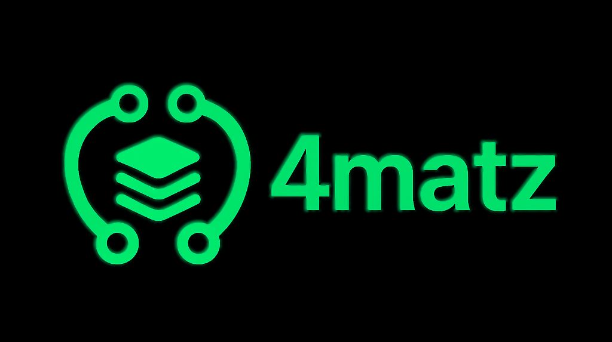

<div align="center">
  

  # 4matz

  ### Multi-Format Data Converter

  A powerful data conversion platform with templates, analytics, and beautiful UI

  [](LICENSE)
  [](package.json)
  [](CONTRIBUTING.md)
</div>

---

## 🚀 Overview

**4matz** is a modern web-based application that allows users to convert data between multiple formats including JSON, XML, CSV, YAML, TOML, HTML, Markdown, and plain text. With a beautiful UI, dark mode support, and powerful features like template management and conversion history, 4matz makes data conversion effortless.

## Features

- **Multi-Format Support:** Convert between 8 different data formats
- **User Authentication:** Secure login and signup via Supabase Auth
- **Conversion Templates:** Save and reuse conversion configurations
- **History Tracking:** Complete audit trail of all conversions with metrics
- **Template Sharing:** Share conversion templates publicly with unique codes
- **User Preferences:** Customize themes, defaults, and application settings
- **Performance Metrics:** Track conversion size and processing time
- **Public Gallery:** Discover and fork popular conversion templates

## Supported Formats

- JSON (JavaScript Object Notation)
- XML (Extensible Markup Language)
- CSV (Comma-Separated Values)
- YAML (YAML Ain't Markup Language)
- TOML (Tom's Obvious Minimal Language)
- HTML (HyperText Markup Language)
- Markdown
- Plain Text

## Project Status

**Database:** ✅ Production Ready
**Frontend:** 🚧 In Development
**Backend:** 🚧 In Development

### Completed

- [x] Database schema design and implementation
- [x] Row Level Security (RLS) policies
- [x] Performance optimization with indexes
- [x] Automated profile and preference creation
- [x] Template sharing system
- [x] Comprehensive documentation

### In Progress

- [ ] Frontend user interface
- [ ] Conversion logic implementation
- [ ] Authentication UI
- [ ] Template management interface
- [ ] History dashboard

## Documentation

- **[DATABASE_SUMMARY.md](./DATABASE_SUMMARY.md)** - High-level overview of database implementation
- **[DATABASE_HANDOVER.md](./DATABASE_HANDOVER.md)** - Complete technical documentation
- **[QUICK_START_GUIDE.md](./QUICK_START_GUIDE.md)** - Developer quick reference and code examples

## Database Schema

```
auth.users (Supabase Auth)
    ↓
profiles ←→ user_preferences
    ↓
conversion_templates ←→ shared_templates
    ↓
conversion_history
```

### Tables

- **profiles** - User profile information
- **conversion_templates** - Saved conversion configurations
- **conversion_history** - Conversion job tracking with metrics
- **shared_templates** - Public template sharing system
- **user_preferences** - Application settings per user

## Technology Stack

- **Database:** Supabase (PostgreSQL)
- **Authentication:** Supabase Auth
- **Frontend:** (To be implemented)
- **Language:** JavaScript/TypeScript

## Getting Started

### Prerequisites

- Node.js 18+ or compatible runtime
- Supabase account and project
- NPM or PNPM package manager

### Installation

1. Clone the repository
```bash
git clone <repository-url>
cd DataTextConverter_Project
```

2. Install dependencies
```bash
npm install
```

3. Set up environment variables
```bash
# .env file is already configured with Supabase credentials
# VITE_SUPABASE_URL=https://wpjoxxtknefrsioccwjq.supabase.co
# VITE_SUPABASE_SUPABASE_ANON_KEY=<your-key>
```

4. Install Supabase client
```bash
npm install @supabase/supabase-js
```

5. Start development
```bash
npm run dev
```

### Quick Code Example

```javascript
import { createClient } from '@supabase/supabase-js';

// Initialize Supabase client
const supabase = createClient(
  process.env.VITE_SUPABASE_URL,
  process.env.VITE_SUPABASE_SUPABASE_ANON_KEY
);

// Create a conversion template
const { data, error } = await supabase
  .from('conversion_templates')
  .insert({
    user_id: user.id,
    name: 'JSON to XML Converter',
    source_format: 'json',
    target_format: 'xml',
    configuration: {
      prettyPrint: true,
      rootElement: 'data'
    }
  })
  .select()
  .maybeSingle();

// Save conversion to history
await supabase
  .from('conversion_history')
  .insert({
    user_id: user.id,
    source_format: 'json',
    target_format: 'xml',
    input_size_bytes: 1024,
    output_size_bytes: 2048,
    status: 'completed',
    processing_time_ms: 45
  });
```

See [QUICK_START_GUIDE.md](./QUICK_START_GUIDE.md) for more examples.

## Database Features

### Security

- Row Level Security (RLS) enabled on all tables
- 19 security policies protecting user data
- Users can only access their own data
- Public templates accessible to all authenticated users
- Anonymous conversion support

### Performance

- 12 strategic indexes for fast queries
- JSONB indexing for flexible configuration search
- Optimized for common query patterns
- Partial indexes for public template discovery

### Automation

- Automatic profile creation on user signup
- Auto-generation of user preferences with defaults
- Automatic timestamp updates on record changes
- Share code generation for template sharing

## API Overview

### Authentication

```javascript
// Sign up
await supabase.auth.signUp({ email, password });

// Sign in
await supabase.auth.signInWithPassword({ email, password });

// Sign out
await supabase.auth.signOut();
```

### Templates

```javascript
// Create template
await supabase.from('conversion_templates').insert({...});

// Get user templates
await supabase.from('conversion_templates')
  .select('*')
  .eq('user_id', userId);

// Get public templates
await supabase.from('conversion_templates')
  .select('*')
  .eq('is_public', true);
```

### History

```javascript
// Save conversion
await supabase.from('conversion_history').insert({...});

// Get user history
await supabase.from('conversion_history')
  .select('*')
  .eq('user_id', userId)
  .order('created_at', { ascending: false });
```

See complete API documentation in [QUICK_START_GUIDE.md](./QUICK_START_GUIDE.md).

## Development Roadmap

### Phase 1: Core Functionality
- [ ] Build authentication UI
- [ ] Implement conversion engine
- [ ] Create template management interface
- [ ] Add history dashboard

### Phase 2: Enhanced Features
- [ ] Public template gallery
- [ ] Template sharing with codes
- [ ] User preferences panel
- [ ] Performance metrics display

### Phase 3: Advanced Features
- [ ] Template ratings and reviews
- [ ] Batch conversion support
- [ ] API access for programmatic use
- [ ] Team/organization support

### Phase 4: Scale & Optimize
- [ ] Analytics dashboard
- [ ] Performance monitoring
- [ ] Advanced caching
- [ ] Load balancing

## Contributing

This project is currently in active development. Contributions, issues, and feature requests are welcome!

## License

[MIT License](./LICENSE)

## Support

For technical documentation, see:
- [DATABASE_HANDOVER.md](./DATABASE_HANDOVER.md) - Complete technical reference
- [QUICK_START_GUIDE.md](./QUICK_START_GUIDE.md) - Quick start guide with examples
- [DATABASE_SUMMARY.md](./DATABASE_SUMMARY.md) - Executive summary

## Project Structure

```
DataTextConverter_Project/
├── .env                      # Environment variables (Supabase config)
├── .gitignore               # Git ignore rules
├── README.md                # This file
├── LICENSE                  # MIT License
├── DATABASE_SUMMARY.md      # Database overview
├── DATABASE_HANDOVER.md     # Complete database documentation
├── QUICK_START_GUIDE.md     # Developer quick reference
└── supabase/
    └── migrations/
        └── 20251009012520_create_core_schema.sql
```

## Database Migration

The database schema is managed through Supabase migrations:

```
Migration: 20251009012520_create_core_schema.sql
Status: Applied ✅
```

This migration creates:
- 5 core tables
- 19 RLS policies
- 12 performance indexes
- 3 automation triggers
- Helper functions

## Acknowledgments

Built with:
- [Supabase](https://supabase.com/) - Backend as a Service
- [PostgreSQL](https://www.postgresql.org/) - Database
- [Vite](https://vitejs.dev/) - Build tool

---

**Status:** Database ready for application development ✅

For questions or support, please refer to the documentation files.
